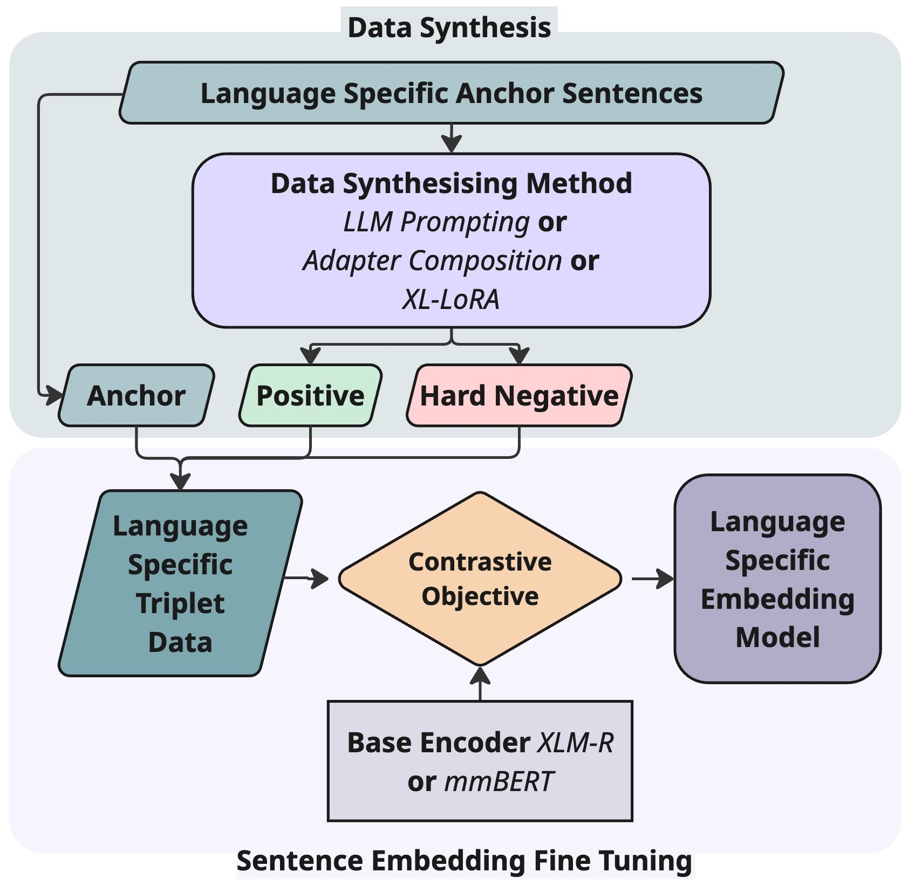

# Bootstrapping Embeddings for Low Resource Languages

Here we provide the official codebase and workflow for "Bootstrapping Embeddings for Low Resource Languages" including the synthesis of triplet data and the fine tuning of sentence embedding models in low-resource settings. A diagram of the data synthesis and fine-tuning pipeline is shown below:



The diagram of XL-LoRA training pipeline is also shown below:


## Updates


## Quick Links

- [Setup](#setup)
- [XL-LoRA Training](#xl-lora-training)
- [Data Synthesis](#data-synthesis)
- [Sentence Embedding Training (SimCSE)](#sentence-embedding-training-simcse)
- [Evaluation](#evaluation)
- [Citation](#citation)

## Setup

This project relies on PyTorch with CUDA support and several GPU-dependent libraries.
To reproduce our results, please use the specified CUDA and PyTorch versions.

### Installing PyTorch
First, install PyTorch following the instructions from the official website:
 https://pytorch.org/get-started/locally/

To reproduce our setup, we use PyTorch 2.6.0 with CUDA 12.6.
If you are using Linux with CUDA 12.6, install PyTorch with:

`pip install torch==2.6.0+cu126 torchvision==0.21.0+cu126 torchaudio==2.6.0+cu126 \
  --index-url https://download.pytorch.org/whl/cu126`

PyTorch versions higher than 2.6.0 with compatible CUDA versions may also work, but are not officially tested.

If you are using CPU-only or an unsupported CUDA version, this project is not guaranteed to work and may fail due to GPU-dependent libraries.

### Installing the other requirements

After installing PyTorch, install the remaining dependencies:
`pip install -r requirements.txt`

### Hugging Face Token (HF_TOKEN)

Some parts of this project require authentication to the Hugging Face Hub (e.g., to download gated models or datasets).  
Set your Hugging Face access token via the `HF_TOKEN` environment variable:

```bash
export HF_TOKEN=hf_XXXXXXXXXXXXXXXX
```

## LoRA Training

The following components use the `lora_training.py` module in the src dir. For a full list of available flags and their descriptions, please refer to the `--help` output of `lora_training.py` or inspect the argument definitions directly in the `lora_training.py` script.

### XL-LoRA Adapters
XL-LoRA adapters consist of two versions: one trained with anchor–hard negative sentence pairs and the other with anchor–positive sentence pairs.

Example commands for training the XL-LoRA models are provided in the scripts folder:
`xllora_train_negative.sh` and `xllora_train_positive.sh.`

The main difference between these two commands is the `--positive_prompts` flag.
When this flag is set, the training script adjusts the prompt format for positive sentence pairs and expects a **sent1** column for the positive examples in the training dataset along with the **sent0** column for the anchor examples.
When this flag is not set, the training prompt is adapted for hard negative training and the dataset is expected to contain a **hard_neg** column instead for the negative examples along with the **sent0** column for the anchor examples.

### English Task Adapters
English task adapters (negative and positive example model versions) are used in both **Adapter Composition** and **XL-LoRA** pipelines. For more information, please refer to our paper.

Example commands for training the English task adapters are provided in the scripts folder:
`ta_train_negative.sh` and `ta_train_positive.sh.`

As with the XL-LoRA adapters, the main difference between the negative and positive training commands is the `--positive_prompts` flag.

### Language Adapters
Language adapters for each language are used in the **Adapter Composition** pipeline.

Example commands for training the Language Adapter (eg for Hausa) is provided in the scripts folder:
`la_train_hausa.sh`

Language adapters primarily use the `CohereLabs/aya_dataset`. If there is insufficient training data for a particular language or if a language is not available, the `--dataset_lan_other` parameter is used to source additional training data from the `CohereLabs/aya_collection_language_split` dataset. 
When the training data contains an `inputs` field, the language adapter prompt is applied by default (e.g., “Given the following text, generate a relevant answer in {language} language”) for causal language modeling. Unlike the other LoRA training setups, this configuration does not involve positive or negative example generation.

For the Adapter Composition method, the merging of language and task adapters follows the code and methodology of [Zhao et al., 2025 – “AdaMergeX: Cross-Lingual Transfer with Large Language Models via Adaptive Adapter Merging”](https://arxiv.org/pdf/2402.18913) is used.

## Data Synthesis
Data synthesis is performed using the `generate_answers_mgpu_orch.py` module in the src dir, which orchestrates calls to `generate_answers_multigpu.py`. For a full list of available flags and their descriptions, please refer to the `--help` output of `generate_answers_mgpu_orch.py` or inspect the argument definitions directly in the `generate_answers_mgpu_orch.py` script.

Example commands for synthesizing data (for both positive and hard-negative sentence generation) are provided in the `scripts` folder:  
`data_synthesis_neg.sh` and `data_synthesis_pos.sh`.

The main differences between these two commands are the `--positive_prompts` flag and the `--peft_model_name` setting. The `--positive_prompts` flag adjusts the prompt to generate positive sentences when enabled and hard-negative sentences when disabled. The `--peft_model_name` argument specifies the XL-LoRA adapter and should be selected according to whether positive or hard-negative sentence generation is desired.
The script parses model outputs based on Gemma 3 and LLaMA 3.3 prompt templates and has been tested only with these models. If another model is used, the parsing logic may need to be adapted accordingly.

The `--model_name` flag defines the base model. Providing `--peft_model_name` is optional and enables the use of a LoRA adapter for composition during data synthesis.

## Sentence Embedding Training (SimCSE)
This module (`simcse_train.py` in the `src` directory) is adapted from the SimCSE project (MIT License):  
https://github.com/princeton-nlp/SimCSE

The main modifications are:

- Added support for mmBERT and ModernBERT model architectures to fine-tune these base models into sentence embedding models using the SimCSE training pipeline. Note that this implementation does not include the `cls` pooler type, as a `pooler_output` is not defined in the original model architectures.
- Refactored and consolidated the training code into a single file for easier integration and maintenance.
- Added additional STS evaluation benchmarks beyond STS-B, including SemRel 2024 and STS 2017.

Example commands used to fine tune sentence embedding model (eg. for Hausa with XLM-R base model) using XL-LoRA pipeline can be found in the `scripts` folder:
`sentence_embedding_training_hausa.sh`

## Evaluation

## Citation


